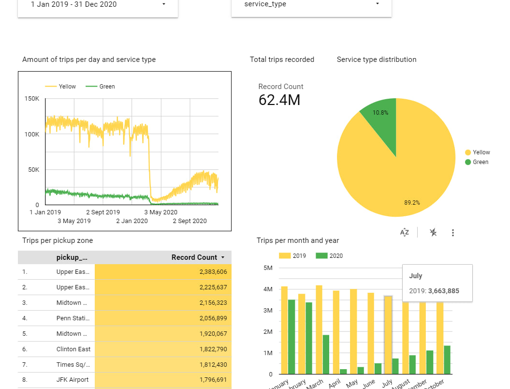
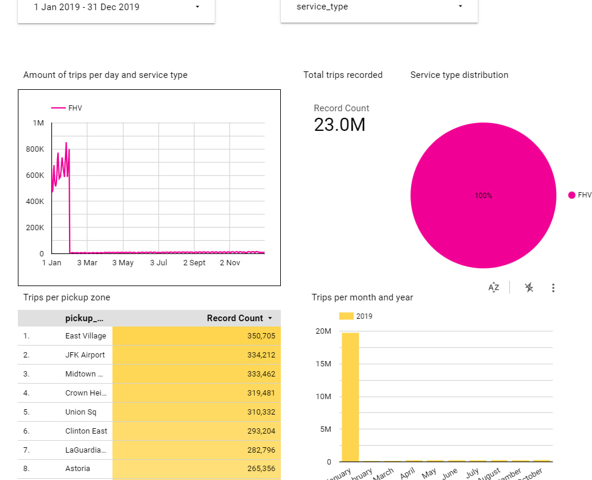

## Question 1:

What happens when we execute `dbt build --vars '{'is_test_run':'true'}'` You'll need to have completed the "Build the first dbt models" video.

 

**Answer**: It applies a limit 100 only to our staging models

 

## Question 2:

What is the code that our CI job will run?

 

**Answer**: The code from any development branch that has been opened based on main

 

## Question 3:

What is the count of records in the model fact_fhv_trips after running all dependencies with the test run variable disabled (:false)?

 

**Answer**: 22998722

 

## Question 4:

What is the service that had the most rides during the month of July 2019 month with the biggest amount of rides after building a tile for the fact_fhv_trips table?

 

 

**answer**: Yellow

 